# Random walk on an n x m lattice

4-neighbor random walk on an n x m interior region with a 1-cell absorbing boundary ring around it (`shapes.rectangle(n, m)`).

num_trials = 20000, seed = 0

## Corners always have exit probability 0

A corner cell's only neighbors are two other boundary cells, so an interior walk can never land on one directly. It's always absorbed one step earlier. True for any n, m.

## 3 x 3 interior lattice

| starting point | mask coords | expected stopping time |
|---|---|---|
| center | (3, 3) | 4.46 ± 0.02 |
| edge_horizontal | (3, 2) | 3.49 ± 0.02 |
| edge_vertical | (2, 3) | 3.49 ± 0.02 |
| corner | (2, 2) | 2.72 ± 0.02 |

### 3x3: center start (3, 3)

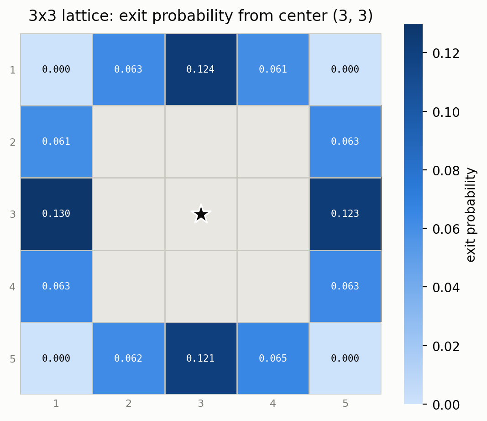

Exit probability by grid position (row \ col match mask coordinates):

| row \ col | 1 | 2 | 3 | 4 | 5 |
|---|---|---|---|---|---|
| **1** | 0.000 (corner) | 0.063 | 0.124 | 0.061 | 0.000 (corner) |
| **2** | 0.061 | interior | interior | interior | 0.063 |
| **3** | 0.130 | interior | **start** | interior | 0.123 |
| **4** | 0.063 | interior | interior | interior | 0.063 |
| **5** | 0.000 (corner) | 0.062 | 0.121 | 0.065 | 0.000 (corner) |

### 3x3: edge_horizontal start (3, 2)

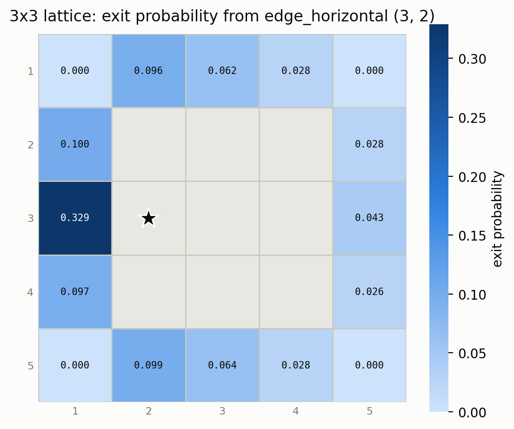

Exit probability by grid position (row \ col match mask coordinates):

| row \ col | 1 | 2 | 3 | 4 | 5 |
|---|---|---|---|---|---|
| **1** | 0.000 (corner) | 0.096 | 0.062 | 0.028 | 0.000 (corner) |
| **2** | 0.100 | interior | interior | interior | 0.028 |
| **3** | 0.329 | **start** | interior | interior | 0.043 |
| **4** | 0.097 | interior | interior | interior | 0.026 |
| **5** | 0.000 (corner) | 0.099 | 0.064 | 0.028 | 0.000 (corner) |

### 3x3: edge_vertical start (2, 3)

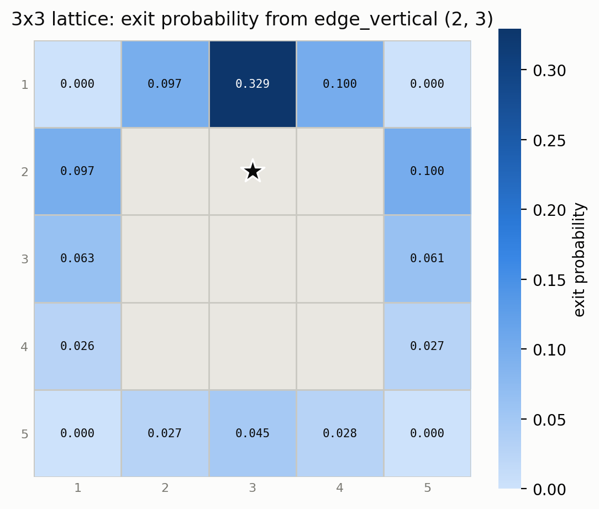

Exit probability by grid position (row \ col match mask coordinates):

| row \ col | 1 | 2 | 3 | 4 | 5 |
|---|---|---|---|---|---|
| **1** | 0.000 (corner) | 0.097 | 0.329 | 0.100 | 0.000 (corner) |
| **2** | 0.097 | interior | **start** | interior | 0.100 |
| **3** | 0.063 | interior | interior | interior | 0.061 |
| **4** | 0.026 | interior | interior | interior | 0.027 |
| **5** | 0.000 (corner) | 0.027 | 0.045 | 0.028 | 0.000 (corner) |

### 3x3: corner start (2, 2)

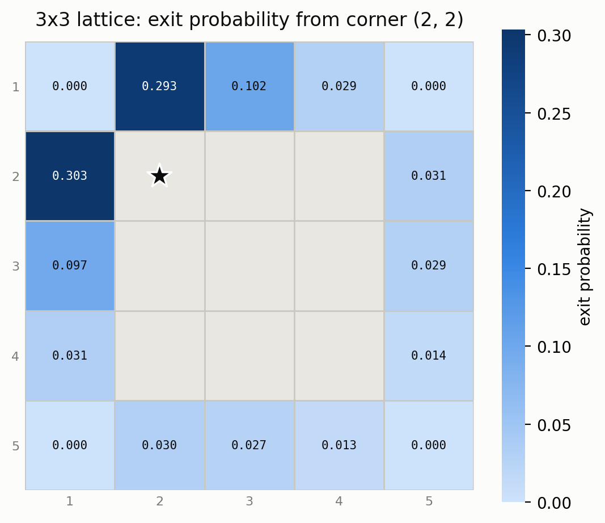

Exit probability by grid position (row \ col match mask coordinates):

| row \ col | 1 | 2 | 3 | 4 | 5 |
|---|---|---|---|---|---|
| **1** | 0.000 (corner) | 0.293 | 0.102 | 0.029 | 0.000 (corner) |
| **2** | 0.303 | **start** | interior | interior | 0.031 |
| **3** | 0.097 | interior | interior | interior | 0.029 |
| **4** | 0.031 | interior | interior | interior | 0.014 |
| **5** | 0.000 (corner) | 0.030 | 0.027 | 0.013 | 0.000 (corner) |

## 5 x 5 interior lattice

| starting point | mask coords | expected stopping time |
|---|---|---|
| center | (4, 4) | 10.40 ± 0.05 |
| edge_horizontal | (4, 2) | 6.15 ± 0.05 |
| edge_vertical | (2, 4) | 6.14 ± 0.05 |
| corner | (2, 2) | 3.76 ± 0.04 |

### 5x5: center start (4, 4)

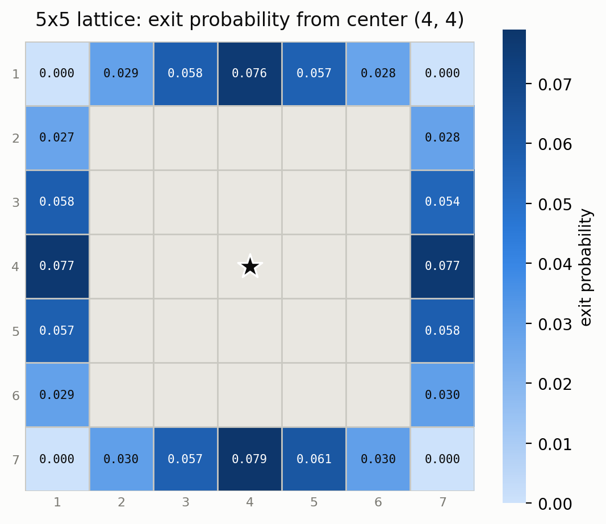

Exit probability by grid position (row \ col match mask coordinates):

| row \ col | 1 | 2 | 3 | 4 | 5 | 6 | 7 |
|---|---|---|---|---|---|---|---|
| **1** | 0.000 (corner) | 0.029 | 0.058 | 0.076 | 0.057 | 0.028 | 0.000 (corner) |
| **2** | 0.027 | interior | interior | interior | interior | interior | 0.028 |
| **3** | 0.058 | interior | interior | interior | interior | interior | 0.054 |
| **4** | 0.077 | interior | interior | **start** | interior | interior | 0.077 |
| **5** | 0.057 | interior | interior | interior | interior | interior | 0.058 |
| **6** | 0.029 | interior | interior | interior | interior | interior | 0.030 |
| **7** | 0.000 (corner) | 0.030 | 0.057 | 0.079 | 0.061 | 0.030 | 0.000 (corner) |

### 5x5: edge_horizontal start (4, 2)

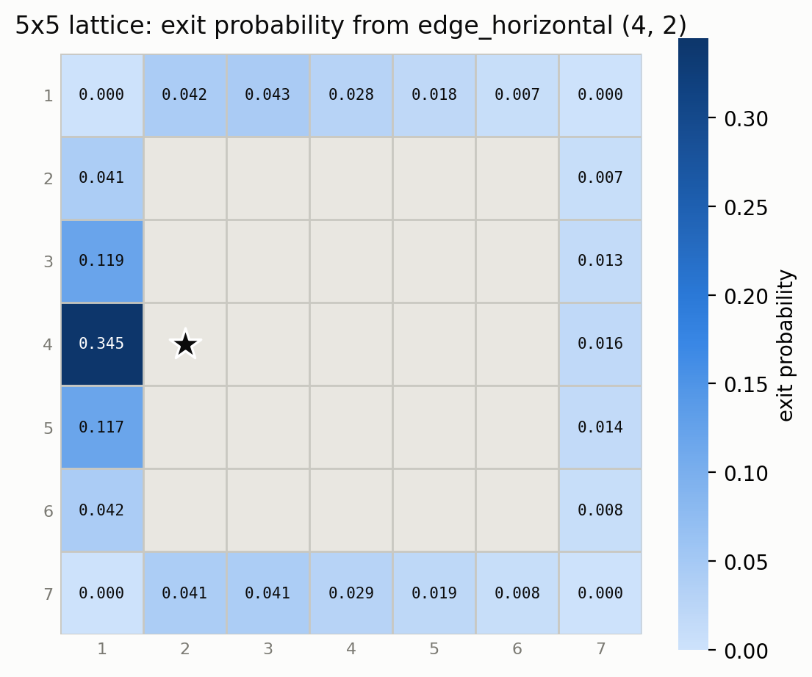

Exit probability by grid position (row \ col match mask coordinates):

| row \ col | 1 | 2 | 3 | 4 | 5 | 6 | 7 |
|---|---|---|---|---|---|---|---|
| **1** | 0.000 (corner) | 0.042 | 0.043 | 0.028 | 0.018 | 0.007 | 0.000 (corner) |
| **2** | 0.041 | interior | interior | interior | interior | interior | 0.007 |
| **3** | 0.119 | interior | interior | interior | interior | interior | 0.013 |
| **4** | 0.345 | **start** | interior | interior | interior | interior | 0.016 |
| **5** | 0.117 | interior | interior | interior | interior | interior | 0.014 |
| **6** | 0.042 | interior | interior | interior | interior | interior | 0.008 |
| **7** | 0.000 (corner) | 0.041 | 0.041 | 0.029 | 0.019 | 0.008 | 0.000 (corner) |

### 5x5: edge_vertical start (2, 4)

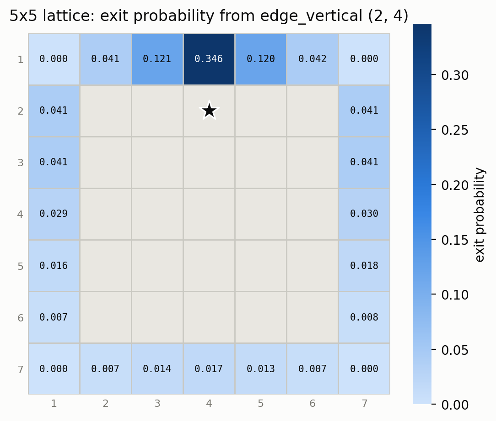

Exit probability by grid position (row \ col match mask coordinates):

| row \ col | 1 | 2 | 3 | 4 | 5 | 6 | 7 |
|---|---|---|---|---|---|---|---|
| **1** | 0.000 (corner) | 0.041 | 0.121 | 0.346 | 0.120 | 0.042 | 0.000 (corner) |
| **2** | 0.041 | interior | interior | **start** | interior | interior | 0.041 |
| **3** | 0.041 | interior | interior | interior | interior | interior | 0.041 |
| **4** | 0.029 | interior | interior | interior | interior | interior | 0.030 |
| **5** | 0.016 | interior | interior | interior | interior | interior | 0.018 |
| **6** | 0.007 | interior | interior | interior | interior | interior | 0.008 |
| **7** | 0.000 (corner) | 0.007 | 0.014 | 0.017 | 0.013 | 0.007 | 0.000 (corner) |

### 5x5: corner start (2, 2)

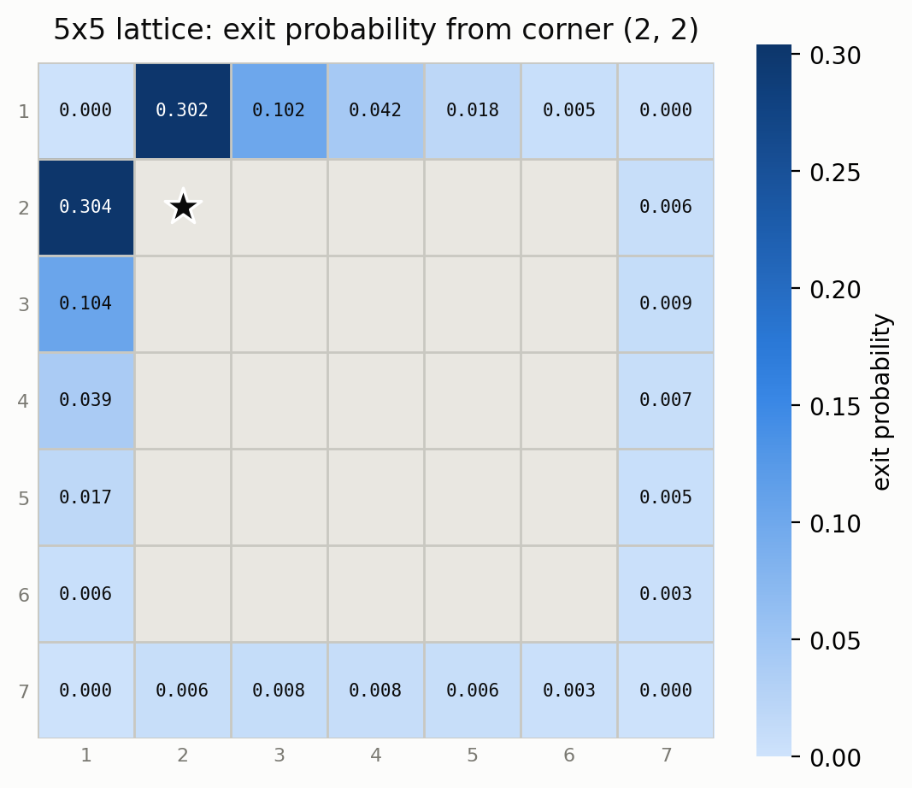

Exit probability by grid position (row \ col match mask coordinates):

| row \ col | 1 | 2 | 3 | 4 | 5 | 6 | 7 |
|---|---|---|---|---|---|---|---|
| **1** | 0.000 (corner) | 0.302 | 0.102 | 0.042 | 0.018 | 0.005 | 0.000 (corner) |
| **2** | 0.304 | **start** | interior | interior | interior | interior | 0.006 |
| **3** | 0.104 | interior | interior | interior | interior | interior | 0.009 |
| **4** | 0.039 | interior | interior | interior | interior | interior | 0.007 |
| **5** | 0.017 | interior | interior | interior | interior | interior | 0.005 |
| **6** | 0.006 | interior | interior | interior | interior | interior | 0.003 |
| **7** | 0.000 (corner) | 0.006 | 0.008 | 0.008 | 0.006 | 0.003 | 0.000 (corner) |

## 3 x 4 interior lattice

| starting point | mask coords | expected stopping time |
|---|---|---|
| center | (3, 3) | 5.34 ± 0.03 |
| edge_horizontal | (3, 2) | 3.87 ± 0.03 |
| edge_vertical | (2, 3) | 4.11 ± 0.03 |
| corner | (2, 2) | 2.99 ± 0.02 |

### 3x4: center start (3, 3)

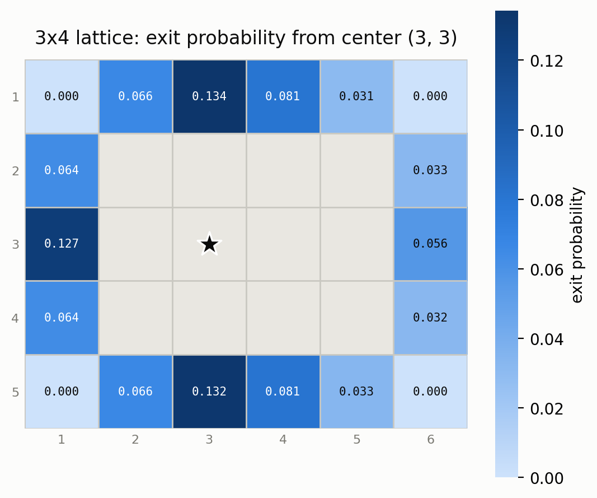

Exit probability by grid position (row \ col match mask coordinates):

| row \ col | 1 | 2 | 3 | 4 | 5 | 6 |
|---|---|---|---|---|---|---|
| **1** | 0.000 (corner) | 0.066 | 0.134 | 0.081 | 0.031 | 0.000 (corner) |
| **2** | 0.064 | interior | interior | interior | interior | 0.033 |
| **3** | 0.127 | interior | **start** | interior | interior | 0.056 |
| **4** | 0.064 | interior | interior | interior | interior | 0.032 |
| **5** | 0.000 (corner) | 0.066 | 0.132 | 0.081 | 0.033 | 0.000 (corner) |

### 3x4: edge_horizontal start (3, 2)

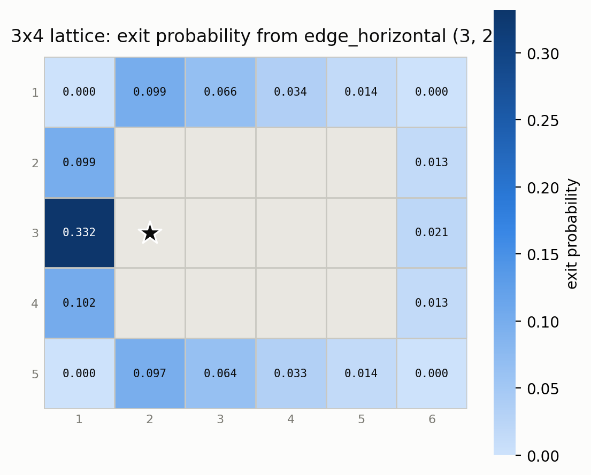

Exit probability by grid position (row \ col match mask coordinates):

| row \ col | 1 | 2 | 3 | 4 | 5 | 6 |
|---|---|---|---|---|---|---|
| **1** | 0.000 (corner) | 0.099 | 0.066 | 0.034 | 0.014 | 0.000 (corner) |
| **2** | 0.099 | interior | interior | interior | interior | 0.013 |
| **3** | 0.332 | **start** | interior | interior | interior | 0.021 |
| **4** | 0.102 | interior | interior | interior | interior | 0.013 |
| **5** | 0.000 (corner) | 0.097 | 0.064 | 0.033 | 0.014 | 0.000 (corner) |

### 3x4: edge_vertical start (2, 3)

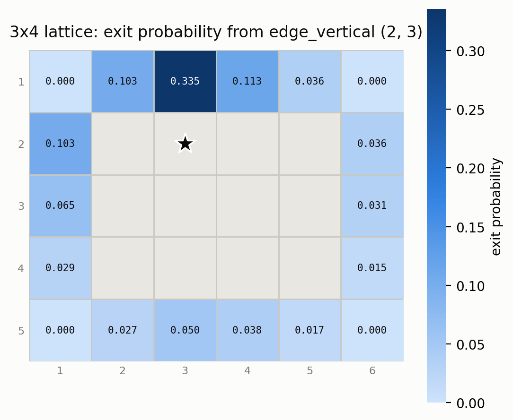

Exit probability by grid position (row \ col match mask coordinates):

| row \ col | 1 | 2 | 3 | 4 | 5 | 6 |
|---|---|---|---|---|---|---|
| **1** | 0.000 (corner) | 0.103 | 0.335 | 0.113 | 0.036 | 0.000 (corner) |
| **2** | 0.103 | interior | **start** | interior | interior | 0.036 |
| **3** | 0.065 | interior | interior | interior | interior | 0.031 |
| **4** | 0.029 | interior | interior | interior | interior | 0.015 |
| **5** | 0.000 (corner) | 0.027 | 0.050 | 0.038 | 0.017 | 0.000 (corner) |

### 3x4: corner start (2, 2)

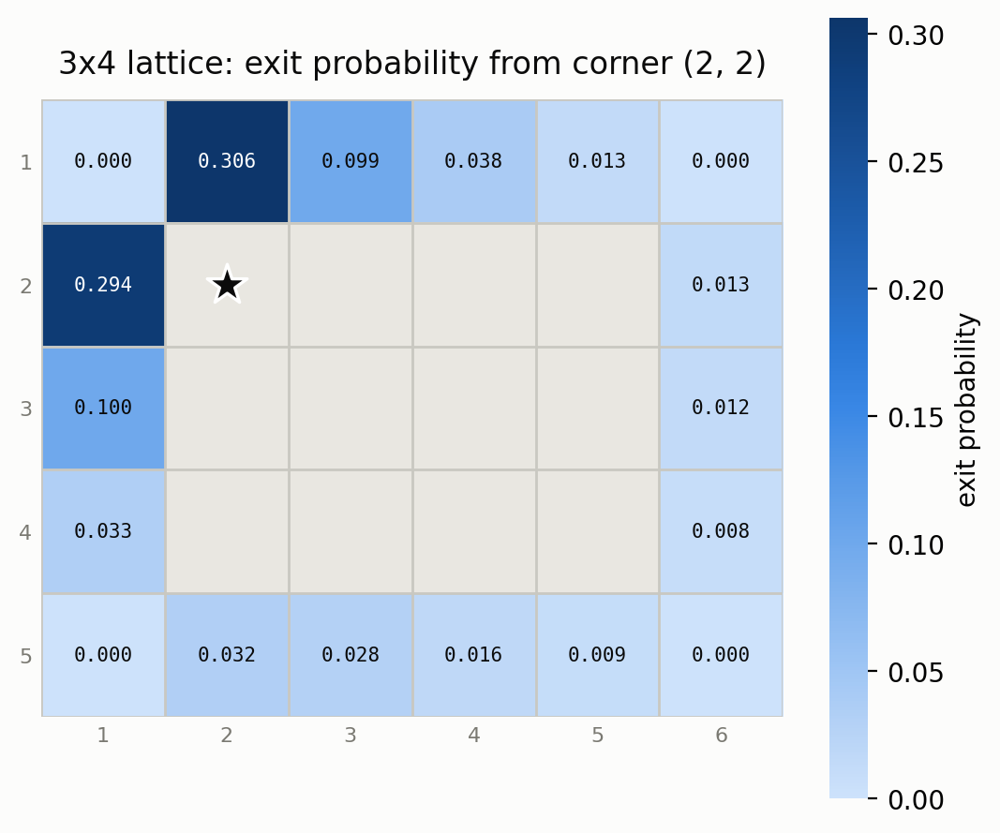

Exit probability by grid position (row \ col match mask coordinates):

| row \ col | 1 | 2 | 3 | 4 | 5 | 6 |
|---|---|---|---|---|---|---|
| **1** | 0.000 (corner) | 0.306 | 0.099 | 0.038 | 0.013 | 0.000 (corner) |
| **2** | 0.294 | **start** | interior | interior | interior | 0.013 |
| **3** | 0.100 | interior | interior | interior | interior | 0.012 |
| **4** | 0.033 | interior | interior | interior | interior | 0.008 |
| **5** | 0.000 (corner) | 0.032 | 0.028 | 0.016 | 0.009 | 0.000 (corner) |

